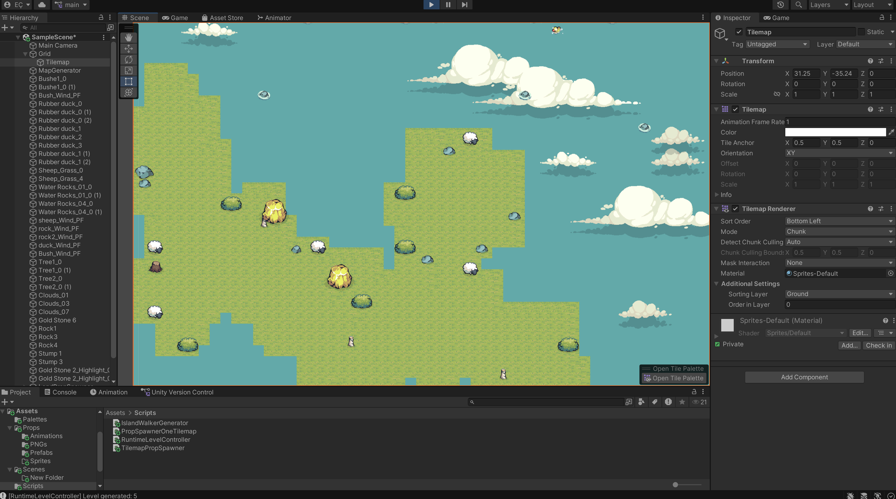

# Unity Procedural Map Generator

This project is a procedural map generator I built in Unity using C#.

---

## Demo

---

## Overview

The goal of this project is to generate maps automatically instead of designing them manually.

Each time the project runs, it creates a new map with different island shapes and object placements.

---

## How It Works

The system uses random generation to create maps.

- Island shapes are generated randomly  
- The terrain is created at runtime  
- Props like trees and rocks are placed automatically  
- Every run produces a different result  

So the maps are never the same.

---

## Features

- Procedural map generation  
- Random island shapes  
- Automatic prop placement  
- Tile-based system  
- Infinite possible maps  

---

## Technologies

- Unity  
- C#  
- Tilemap  

---

## Project Structure

- Scripts → main logic  
- Scenes → demo scene  
- Assets → sprites and prefabs  

---

## Usage

Open the project in Unity and run the scene to see the generated map.

---

## Notes

This project focuses on the core generation logic. It can be extended and used in different types of games.

---

Author: Enes Celik
